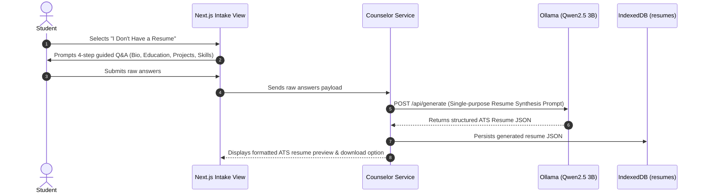
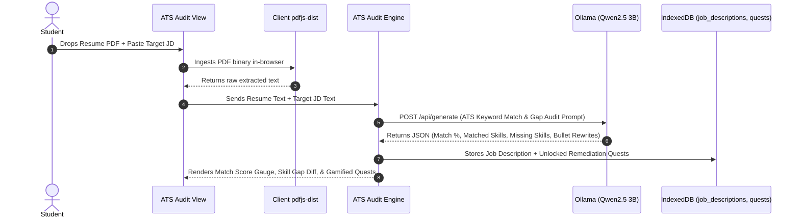
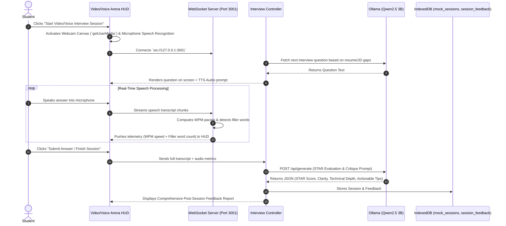

# AURA — System Architecture & Technical Specifications

**Version:** 1.0.0  
**Target Hardware:** 8 GB – 16 GB RAM Consumer Laptop (HP Victus / Equivalent)  
**Execution Runtime:** 100% Local-First / Zero Cloud Dependencies  
**Local AI Model:** Qwen2.5 3B (via Ollama local daemon on `http://127.0.0.1:11434`)  

---

## 1. Executive Architecture Summary

AURA (AI-Powered Resume & Interview Coach) is built on a **decoupled, edge-computed multi-layer architecture**. All student data (resumes, video/audio transcripts, skill profiles, and assessment reports) strictly resides inside the user's browser via **IndexedDB**. 

The system uses **Ollama** running **Qwen2.5 3B** locally for structured LLM tasks (intake synthesis, ATS keyword matching, interview question generation, and STAR feedback evaluation). Real-time video/voice interview analytics (speaking cadence in WPM and filler-word detection) are processed through high-frequency WebSockets over local IPC (`ws://127.0.0.1:3001`).

```
+-----------------------------------------------------------------------------------+
|                                 PRESENTATION LAYER                                |
|    Next.js Pages (App Router) | Tailwind CSS | Video & Voice Arena Canvas HUD     |
+----------------------------------------+------------------------------------------+
                                         |
                                         v
+-----------------------------------------------------------------------------------+
|                                APPLICATION LAYER                                  |
|   Counselor Service | ATS Parser & Audit | Gamification | Interview Controller   |
+----+-----------------------------------+------------------------------------+-----+
     |                                   |                                    |
     v                                   v                                    v
+----+-------------------+   +-----------+------------------+   +-------------+-----+
|    LOCAL AI ENGINE     |   |     REAL-TIME COMMS        |   |    STORAGE LAYER    |
| Ollama (qwen2.5:3b)    |   | WebSockets (ws://...3001) |   | IndexedDB Stores    |
| HTTP / API Generate    |   | Audio Pacing & Transcripts   |   | Client Browser      |
+------------------------+   +------------------------------+   +---------------------+
```

---

## 2. Comprehensive Layer Breakdown

### 2.1 Presentation Layer
- **Framework:** Next.js (App Router, JavaScript ES6+).
- **Styling & Tokens:** Tailwind CSS (`v3.4+`) adhering strictly to the **Industrial Orange & Pitch Black** design system:
  - Background: Pitch Black (`#09090B` / `bg-zinc-950`)
  - Primary Brand: Electric Orange (`#F97316` / `bg-orange-500`)
  - Accent: Amber Orange (`#FB923C` / `bg-orange-400`)
  - Surface: Zinc Surface (`#18181B` / `bg-zinc-900`)
  - Borders: Border Zinc (`#27272A` / `border-zinc-800`)
- **Key Views:**
  - `Counselor Intake View`: Step-by-step interactive Q&A for students without resumes.
  - `ATS Audit & Upload Hub`: Client-side drag-and-drop PDF parse + job description audit split-screen.
  - `Gamified Quest Hub`: Dynamic quests, level badges (*Placement Novice* -> *Job-Ready Slayer*), circular readiness score SVG.
  - `Video/Voice Interview Arena`: Live webcam video container, microphone status, real-time WPM pacing gauge, filler-word counters, AI interviewer voice/text feed.
  - `Interview Evaluation Report`: Multi-dimensional post-session analytics (Clarity, STAR structure, Technical depth, Confidence).

### 2.2 Application & Service Layer
- **Counselor Intake Engine:** Guides students through bio, project experience, and technical skills; builds standardized JSON for resume synthesis.
- **Client PDF Parsing Service:** Uses `pdfjs-dist` to extract plain text from uploaded PDF resumes directly in the browser without server uploads.
- **ATS Match Engine:** Performs keyword extraction, missing competency analysis, and Google X-Y-Z bullet rewrites (`"Accomplished [X] as measured by [Y], by doing [Z]"`).
- **Gamification & Quest Controller:** Calculates overall Readiness Score (0–100%), maps missing ATS skills to unlockable quests, manages XP progression and streak counts.
- **Video/Voice Interview Controller:** Manages video stream state (`navigator.mediaDevices.getUserMedia`), coordinates Web Speech API (`webkitSpeechRecognition`) audio capture, streams text chunks to WebSocket server.
- **Learning & LeetCode Recommender:** Maps identified resume/JD skill gaps to curated LeetCode problem patterns (e.g., Two Pointers, Sliding Window, Fast & Slow Pointers).

### 2.3 Local AI Runtime Layer (Ollama + Qwen2.5 3B)
- **Engine:** Ollama local service on `http://127.0.0.1:11434`.
- **Model:** `qwen2.5:3b` quantized (Q4_K_M, memory footprint ~2.2 GB).
- **Prompt Architecture:**
  - Small model constraints require **strict single-purpose prompts** returning guaranteed JSON schema.
  - Retries and fallbacks wrap all AI service calls.
- **AI Service Responsibilities:**
  1. *Resume Generation:* Synthesizes raw conversational intake answers into LaTeX/ATS JSON.
  2. *ATS Gap Analysis:* Compares extracted resume text against target JD text.
  3. *Interview Question Generation:* Generates targeted technical, HR, and behavioral questions based on resume gaps.
  4. *STAR & Communication Critique:* Evaluates student interview responses for STAR methodology, technical accuracy, and improvement areas.

### 2.4 Real-Time Communication Layer (WebSockets)
- **Protocol:** Full-duplex WebSocket connections on `ws://127.0.0.1:3001`.
- **Responsibilities:**
  - Receives live transcript chunks from Web Speech API during Video/Voice mock interviews.
  - Calculates real-time Words Per Minute (WPM) pacing (Target: 130–160 WPM).
  - Counts filler words (*"um"*, *"uh"*, *"like"*, *"you know"*, *"basically"*).
  - Emits real-time HUD telemetry back to the client interface.

### 2.5 Storage Layer (IndexedDB)
- **Location:** Client-side browser storage (Zero Cloud Data Residency).
- **Primary Object Stores:**
  - `profiles`: Student details, target roles, current level/XP.
  - `resumes`: Stored structured resume JSON and parsed uploaded text.
  - `job_descriptions`: Target JDs and extracted skill requirements.
  - `mock_sessions`: Complete video/voice interview recordings metadata, transcripts, and telemetry logs.
  - `session_feedback`: Evaluated STAR breakdown, score cards, and improvement roadmaps.
  - `quests`: Unlocked remediation tasks, completed states, and XP gains.
  - `user_stats`: Readiness history, streak calendar, level progress.

### 2.6 Chrome Extension Layer (Post-Session Analysis Only)
- **Manifest Version:** Manifest V3.
- **Permissions:** `activeTab`, `scripting`, `offscreen`, `storage`.
- **Boundary Rule:** **Strictly Post-Session Analysis Only**. The extension captures interview audio pacing during practice sessions, but **NEVER provides live answer suggestions, hints, or response generation** during an actual interview.

### 2.7 Static Resource Layer
- **Static Datasets (`/data`):**
  - `dsa_patterns.json`: 15 core LeetCode pattern mappings with sample problems and concepts.
  - `interview_rubrics.json`: STAR methodology criteria, communication scoring metrics.
  - `role_skill_maps.json`: Standardized industry skill requirements across Frontend, Backend, Fullstack, AI/ML, and Data Engineering roles.

---

## 3. Data Flow Diagrams

### 3.1 Path A: No-Resume Guided AI Counselor Flow



### 3.2 Path B: Existing-Resume Upload & ATS Gap Audit Flow



### 3.3 Path C: Video/Voice Mock Interview & Feedback Flow



---

## 4. Hardware Baseline & Performance Budget

To run smoothly on target hardware (**8 GB RAM / Windows 11 / HP Victus**):
- **Ollama Context Window:** Capped at 2048 tokens per prompt to prevent high VRAM usage.
- **Model Quantization:** Q4_K_M quantized Qwen2.5 3B model (~2.2 GB VRAM/RAM footprint).
- **Client PDF Parsing:** Executed in web worker to avoid main thread UI freezes.
- **WebSocket Streaming:** Debounced telemetry updates at 250ms intervals.

---

## 5. Security, Privacy & Compliance Rules

1. **Zero External Network Calls:** The application MUST NOT send any telemetry, user resume, transcripts, or personal data to remote servers or cloud AI providers.
2. **Local Audio Stream Safety:** Microphones and webcams are accessed strictly in-browser (`localhost`). Audio files are never written to disk or recorded outside memory buffers.
3. **Chrome Extension Mandate:** The Chrome companion extension is restricted to post-session performance metric logs (pace, filler words). Live interview assistance or answer generation is prohibited.
